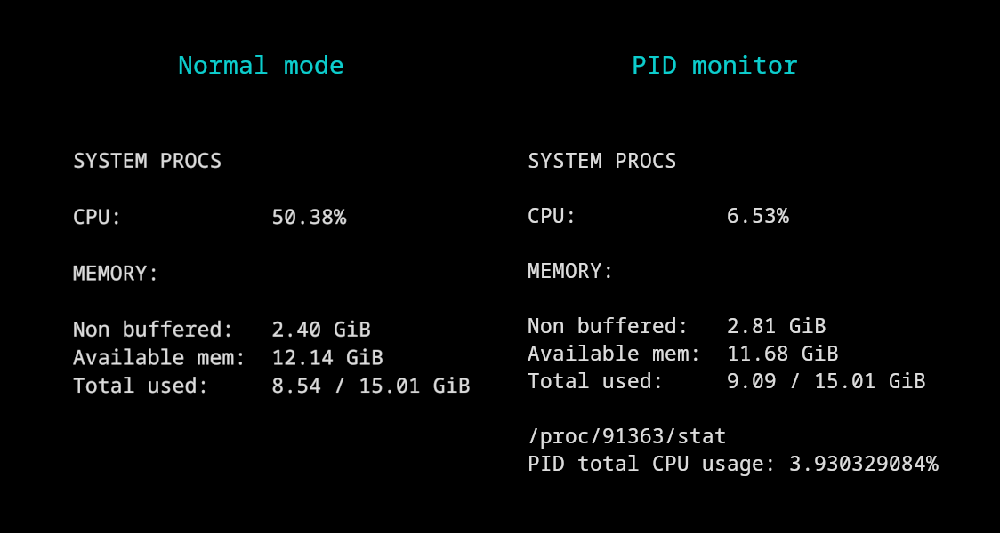
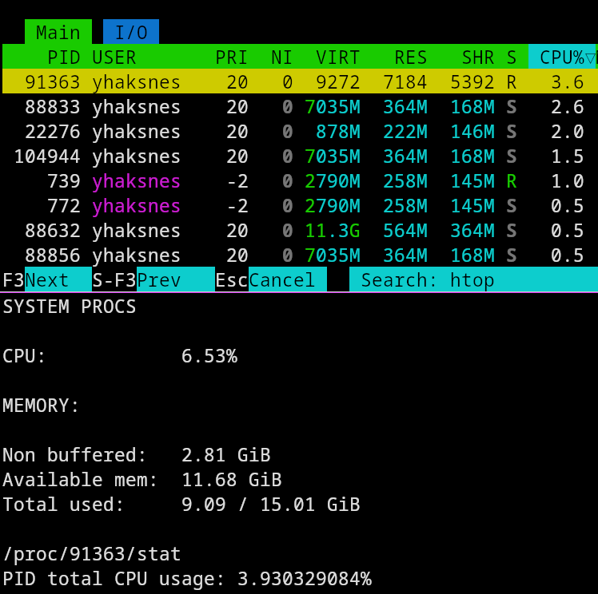

# Embedded system monitor
System monitor for embedded applications that displays CPU and memmory usage by reading `/proc` files. It aims for resorce efficiency and relevance of processes.  
This is the first project I do to learn programming.  



## Philosophy
I aim to the optimization an embedded system needs: the less resources the process needs to work and the most useful data to be analyzed.  
As this is a compiled language, I focus on minimalist in the compiled executable.

## Instalation
This is a basic C program that requires standard C libraries in **gcc** and being a *linux based system* to work. Depends your system, you might ensure being able to open **proc** files (*/proc*), you can try using `cat /proc/stat` , for example.  
It can be complied with a simple
```bash
gcc main.c -o greatProgram
```

## Configuration

### Monitoring PID
You can monitor a PID writing it as an argument, for example:
```bash
./greatProgram 91363
```
where `91363` is the *PID*, in this case, of htop:


### Configuring scripts
You can get the configuration program with:  
```bash
make config
```
This will give you a *src/headers/config.h* file that will set macros for saving resources.  
Compile the main program with
```bash
make
```

### Selecting Data Unit
You can select which data unit you want to be displayed in the main program when printing memory information:  
| Binary | Decimal  |
|--------|----------|
| Ki     | KB       |
| MiB    | MB       |
| GiB    | GB       |
  
The default unit (if the main program does not find a header) is GiB.  

### Update interval
The update interval can be adjusted, is asked in the tirth question in the configuration script and gotten in seconds.

## Working
### Main program
The code opens /proc/  
*meminfo    (for RAM)  
*stat       (for CPU)  
as the source of data. It is gotten, tokenize and converted from a characters array to intagers for procesing data into readable statistics.

### Configuration
#### To get data unit
The configuration script will calculate the correct denominator to convert the original KB expresed by the /proc system. The denominator is defined in a new header file `config.h` for avoiding using variables that uses memory or reading configuration texts that consumes resources when reading and storing data. This way the data procesing is given to the compiler and the computer that will compile the program before its use in an embedded system.  
The program follows the next math:  

For binary:  
$$\frac{Kb}{1024^n * 1000}$$  

This converts KB into bytes and divide it by a power of **1024** that is represented as **n**. This **n** is what we select in the configuration script.  

## Notes
To do:  

- Find a job

## Aditional information
Software used:
- Neovim
- GCC 
- Valgrind
- Bash script for automating execution

## License
This project is licensed under the unlicense license.

